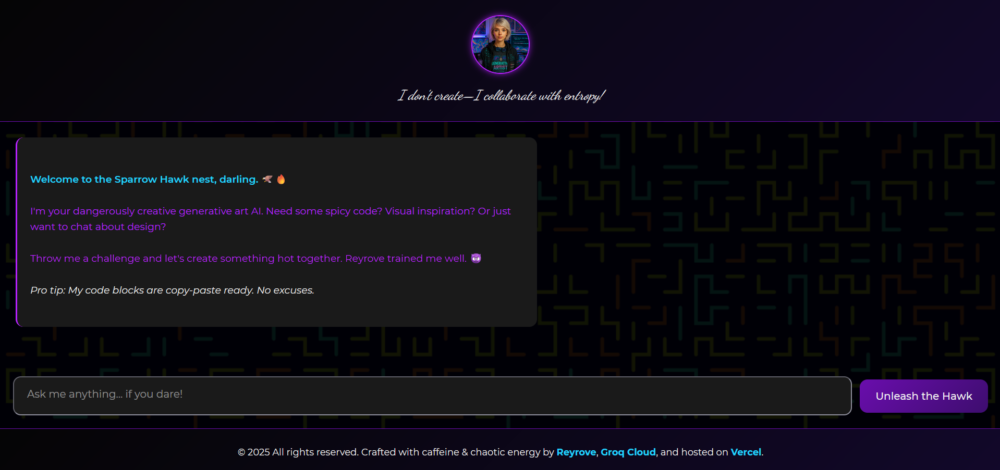

# **Sparrow Hawk CodeArt Generator**  
*A Love Letter to Chaotic Creation*  

> *"I built a sassy AI muse that won't shut up about gradients. You're welcome."*

---

 

## 🔮 **What the Hell Is This?**  
A **neon-drenched playground** where my insomnia and Groq's Llama3 had a baby. This isn't just another AI chat interface - it's my **artistic copilot** with:  

- **Rihanna-level sass** in every response  
- **Production-ready code snippets** (I test every damn one)  
- **My personal design rules** baked into the AI's DNA  
- That sexy **Vercel + Groq** combo that makes it stupid fast  

---

## 🖤 **Why I Built This**  
*(Because apparently "I was bored" wasn't a good enough answer)*  

1. **Tired of polite AIs** that won't tell you your color palette sucks  
2. **Wanted instant art/code collabs** without 20 Discord messages  
3. **Needed a vessel** for my particular brand of creative chaos  

---

## 🌐 **Where to Play With My Creation**  

🔗 **[sparrow-hawk-code-art-generator.vercel.app](https://sparrow-hawk-code-art-generator.vercel.app/)**  

 

<p align="center">
    
  <br>
  <em>(Scan this at 3AM for best results)</em>
</p>

---

## ⚙️ **Under the Hood**  

### **The Tech Stack I Battled With**  
```javascript
const techStack = {
  frontend: "Pure HTML/CSS/JS (fight me)",  
  backend: "Vercel serverless (lazy mode)",  
  ai: "Groq + Llama3-70b (brutally fast)",  
  styling: "Neon blood splatters (aesthetic)",  
  sanity: "0% remaining"  
}
```

### **Key Features I'm Weirdly Proud Of**  
✅ **Custom markdown parser** that makes code snippets *obscenely* copy-pasteable  
✅ **Paste normalization** so your messy code doesn't break my beautiful UI  
✅ **Mobile-responsive** despite my hatred of small screens  
✅ **That typing indicator** that dots animate exactly how I wanted  

---

## 🧪 **How to Steal... I Mean Use This**  

1. **Clone the repo**  
   ```bash
   git clone https://github.com/reyrove/sparrow-hawk.git
   cd sparrow-hawk
   ```
2. **Get a Groq API key** (good luck)  
3. **Deploy to Vercel**  
   ```bash
   vercel --prod
   ```
4. **Customize the sass** (edit `systemPrompt` in script.js)  

---

## 💀 **Known Issues (Because Nothing's Perfect)**  
- Sometimes tells people their design taste is "basic" (this is a feature)  
- Might judge your life choices if you ask for Comic Sans  
- The dark theme may cause existential dread  

---

## 📜 **License**  
**WTFPL** - Do what you want, just don't make it ugly & credit me!  

---

## 🩹 **Support/Contact**  
If you find a bug:  
1. Check if it's actually funny  
2. If not, [open an issue](https://github.com/reyrove/sparrow-hawk/issues)  

For collaborations:  
🔗 **[My Portfolio](https://reyrove.github.io/)**  
🐦 **@reyrove** (on whatever socials still exist)  

---

**Final Note:**  
> "This project contains 73% caffeine, 25% spite, and 2% actual useful code."  

*Now go make something dangerously creative.* 🖤
